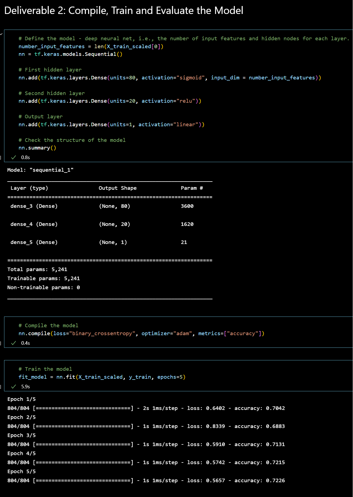
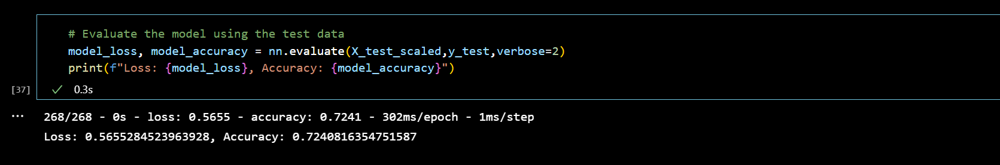
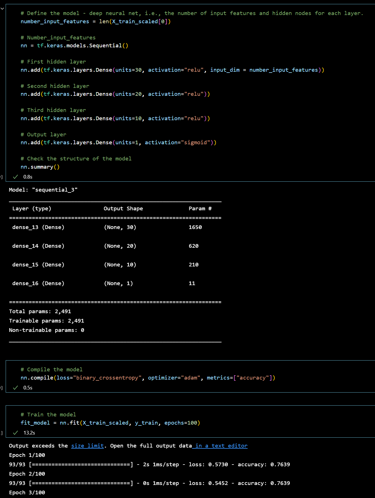
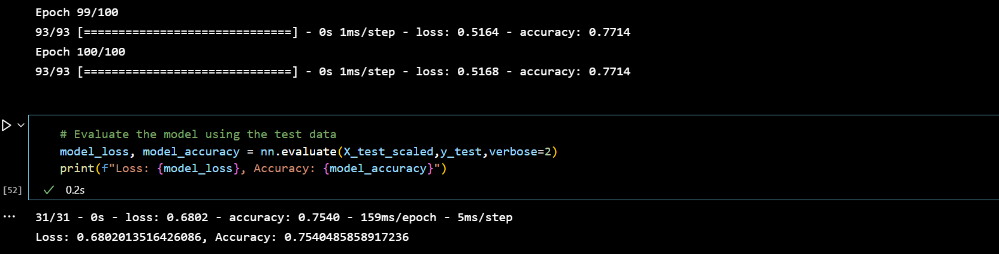

# Neural_Network_Charity_Analysis

#### by Christopher Madden

## Overview

In this module, we'll explore and implement neural networks using the TensorFlow platform in Python. We'll discuss the background and history of computational neurons as well as current implementations of neural networks as they apply to deep learning. We'll discuss the major costs and benefits of different neural networks and compare these costs to traditional machine learning classification and regression models. Additionally, we'll practice implementing neural networks and deep neural networks across a number of different datasets, including image, natural language, and numerical datasets. Finally, we'll learn how to store and retrieve trained models for more robust uses.

To complete the challenge, one must be able to:
- Compare the differences between the traditional machine learning classification and regression models and the neural network models.
- Describe the perceptron model and its components.
- Implement neural network models using TensorFlow.
- Explain how different neural network structures change algorithm performance.
- Preprocess and construct datasets for neural network models.
- Compare the differences between neural network models and deep neural networks.
- Implement deep neural network models using TensorFlow.
- Save trained TensorFlow models for later use.

A foundation, Alphabet Soup, wants to predict where to make investments.  The goal is to use machine learning and neural networks to apply features on a provided dataset to create a binary classifier that is capable of predicting whether applicants will be successful if funded by Alphabet Soup.  The initial file has 34,000 organizations and a number of columns that capture metadata about each organization from past successful fundings.

## Results


**Data Preprocessing**

- What variable(s) are considered the target(s) for your model?
  - The binary variable 'IS_SUCCESSFUL' is the target for the model.
- What variable(s) are considered to be the features for your model?
  - The feature variables are 'APPLICATION_TYPE', 'AFFILIATION', 'CLASSIFICATION', 'USE_CASE', 'ORGANIZATION', 'STATUS', 'INCOME_AMT', 'SPECIAL_CONSIDERATIONS' and 'ASK_AMT'.
- What variable(s) are neither targets nor features, and should be removed from the input data?
  - 'EIN' and 'NAME' are neither targets nor features and could be removed from the input data.

**Compiling, Training, and Evaluating the Model**

- How many neurons, layers, and activation functions did you select for your neural network model, and why?
  - Layer 1: 120 neurons, relu activation
  - Layer 2: 80 neurons, relu activation
  - Layer 3: 40 neurons, sigmoid activation
  - Layer 4: 20 neurons, sigmoid activation
  - This seemed like a nice mix that I felt might yield positive results.

- Were you able to achieve the target model performance?
  - Target performance of 75.00% was not achieved.  The best performance achieved is 72.41%


- What steps did you take to try and increase model performance?
  - I tried increasing the number of layers as well as trying other methods such as tanh activation.  Also, different combinations of activations in different orders with varying numbers of layers.

---

## Summary

The best method I was able to find was to remove the following columns: EIN, STATUS, CLASSIFICATION, and APPLICATION_TYPE.
The next step is to compile, train and evaluate the model as shown below:


This increased our accuracy to an acceptable 75.40%


# -----NEW-----

# Neural Network Charity Analysis

**Christopher Madden** | [LinkedIn](http://bit.ly/4uMMPV7) | [GitHub Portfolio](https://bit.ly/3Pz5LS3)

---

## Project Overview

This project uses deep learning to build a binary classification model that predicts whether nonprofit funding applicants will use donations successfully. Using a dataset of 34,000+ historical funding applications from a fictional foundation called Alphabet Soup, I preprocessed the data, designed and trained a neural network in TensorFlow/Keras, and iteratively optimized the model architecture to improve prediction accuracy.

This is a portfolio project completed as part of my Data Analytics Certificate program at Case Western Reserve University (2022), demonstrating applied machine learning and deep learning skills relevant to real-world predictive modeling problems.

---

## Tools & Skills Demonstrated

- **Language:** Python
- **Libraries:** TensorFlow, Keras, Pandas, scikit-learn
- **Environment:** Jupyter Notebook
- **Techniques:** Neural network design, deep learning, binary classification, data preprocessing, feature engineering, model optimization, categorical encoding
- **Competencies:** Predictive modeling, iterative model improvement, performance evaluation, data cleaning

---

## Dataset

- **Source:** `charity_data.csv` — 34,000+ records of historical nonprofit funding applications
- **Target variable:** `IS_SUCCESSFUL` — binary indicator of whether funding was used effectively
- **Features:** Application type, industry affiliation, classification, use case, organization type, active status, income amount, special considerations, funding amount requested
- **Removed columns:** `EIN` and `NAME` — identifier fields with no predictive value

---

## Analysis Summary

### 1. Data Preprocessing



Before training, the dataset required significant preprocessing:
- Removed non-informative identifier columns (`EIN`, `NAME`)
- Bucketed rare categorical values into an "Other" category to reduce noise
- Encoded all categorical variables using `OneHotEncoder`
- Split data into training and testing sets
- Scaled features using `StandardScaler` to normalize input values for the neural network

---

### 2. Initial Model Design & Training

The first neural network was constructed with four hidden layers using a combination of ReLU and Sigmoid activation functions:

| Layer | Neurons | Activation |
|-------|---------|------------|
| Hidden Layer 1 | 120 | ReLU |
| Hidden Layer 2 | 80 | ReLU |
| Hidden Layer 3 | 40 | Sigmoid |
| Hidden Layer 4 | 20 | Sigmoid |
| Output Layer | 1 | Sigmoid |

**Initial model accuracy: 72.41%** — below the 75% target threshold.



---

### 3. Model Optimization

To improve performance, several optimization strategies were tested:
- Removed additional low-signal columns (`STATUS`, `CLASSIFICATION`, `APPLICATION_TYPE`)
- Adjusted the number of hidden layers and neuron counts
- Experimented with alternative activation functions including `tanh`
- Tested different combinations of layer depth and activation ordering

**Optimized model architecture:**



**Optimized model accuracy: 75.40%** — exceeding the 75% target threshold. ✅



The key improvement came from removing additional low-variance columns that were introducing noise rather than predictive signal, allowing the model to focus on the most informative features.

---

## Key Takeaways

- Feature selection has an outsized impact on neural network performance — removing noisy columns yielded more improvement than adding layers or changing activation functions
- Deep learning models require iterative tuning; the first architecture is rarely optimal
- For binary classification problems like this, simpler feature sets often outperform kitchen-sink approaches

---

## Repository Structure

```
Neural_Network_Charity_Analysis/
├── AlphabetSoupCharity.ipynb               # Initial model notebook
├── AlphabetSoupCharity_Optimzation.ipynb   # Optimized model notebook
├── AlphabetSoupCharity.h5                  # Saved initial model weights
├── AlphabetSoupCharity_Optimization.h5     # Saved optimized model weights
├── Resources/                              # Source dataset
├── Images/                                 # Model output screenshots
└── README.md
```

---

## About the Author

I am a Data Analyst with experience in SQL, Python, R, Power BI, Tableau, and Excel. I specialize in data cleaning, statistical analysis, dashboard development, and translating complex data into clear business insights.

📧 maddenc33@gmail.com | [LinkedIn](http://bit.ly/4uMMPV7) | [GitHub](https://bit.ly/3Pz5LS3)
